# 🏦 Monopoly Forge

A hot-seat Monopoly game for 2–6 players, built from scratch in **TypeScript** on
**Phaser 3** — with a rules engine that runs, and is tested, without a browser.

The longer goal is in the name: an **engine for Monopoly-style board games**, where
the map, the rules and the look of every element are things you configure rather
than things you edit. Building the classic game first is the deliberate route
there — see [Where this is going](#where-this-is-going--from-game-to-engine).

[](https://github.com/Dimitriuses/monopoly-forge/actions/workflows/ci.yml)
[](https://phaser.io/)
[](https://www.typescriptlang.org/)
[](https://vite.dev/)
[](LICENSE)
[](ROADMAP.md)
[](https://dimitriuses.github.io/monopoly-forge/)

## **[▶ Play the demo](https://dimitriuses.github.io/monopoly-forge/)**

No install, no sign-up — it runs in the browser. Pick 2–6 players and hit **START
GAME**; the [controls](#controls) are below. Add `?seed=20260512` to replay an
identical game, or `?debug=1` to watch the full turn trace in the console.

---

## Controls

Everything is mouse-driven — there is no keyboard input.

| Action | How |
|---|---|
| Choose a game | **Play → Game** on the menu, or `?game=ultimate` in the URL. Six ship: **Classic**, **Roundabout**, **Speed Die**, **Orbits**, **Pocket**, **Ultimate**. A game brings its board, its economy, its deck, the palette it prefers and any artwork of its own |
| Change the rules | **Play → Game Settings.** Starting cash, the salary, the jail fine and term, the house supply, how a full colour group is charged, how the game ends — about twenty of them, in sections, each showing what this game would have played |
| Trade with a bot | Bots offer *you* trades on their own turn, in the same panel you build one in. Rationed so it is not every turn, and switchable off in **Play → Game Settings → House rules** |
| Pause | **Escape**, or the MENU button. Resume, save to one of three slots, copy or download the turn log, change the sound, switch the palette **without restarting**, or quit to the title. A save may be taken **mid-turn** — a walking token, an open buy prompt and a live auction all survive a reload |
| See what a player holds | **Click their row in the HUD**, on the right — or **Pause → Inventory** for the list. Cash, net worth, deeds, complete colour groups, houses and hotels, Get Out of Jail Free cards and anything the game itself hands out. Your own spendable ones are rows you press |
| Choose 2–6 players | Click a number on the menu |
| Change a player's token | Click the token name next to `P1`, `P2`, … to cycle |
| Play against the computer | Each seat says **🙋 Human** or **🤖 Bot** — click to swap. Seats 2+ are bots by default |
| Turn on a house rule or a variant | Click a switch under **House rules & variants** before starting, or use `?variants=speedDie` |
| Change how it looks | 🎨 in the menu's top-right corner cycles the theme, or `?theme=parchment` |
| Start | **▶ START GAME**, or **↻ CONTINUE SAVED GAME** if one is waiting |
| Roll | **🎲 ROLL DICE**, below the board (greyed out when it is not your turn to roll) |
| Buy the property you landed on | **✅ BUY** in the prompt |
| Decline it | **❌ PASS** |
| Inspect any tile | Click it — the panel on the right shows the rent ladder, costs and owner. Click it again to close |
| Build, sell, mortgage | Buttons in that panel, for tiles you own, at any point in the game. A greyed-out button still tells you why when clicked |
| Bid on a declined property | **Bid $N** or **PASS** in the auction. A pass is final, and running the 15-second clock out passes for you |
| Trade | **🤝 TRADE**, below the board: pick a partner, click deeds on either side, step the cash, then **PROPOSE** → **ACCEPT**, **DECLINE** or **COUNTER** |
| Save | **💾 SAVE**, below the board. Resume it from the menu next time |
| Mute | **🔊**, below the board |
| Dismiss a Chance / Community Chest card | **OK** |
| Leave jail | **🔓 Pay $50** (or **🃏 Use Card** if you hold one) — appears below the board only when you are in jail and can afford it |

Hot-seat: all players share one screen, and the HUD on the right shows whose turn
it is.

---

## What it is

A complete implementation of the Monopoly turn loop: dice with doubles and the
three-doubles jail rule, step-by-step token movement, property/railroad/utility
purchase, the full rent ladder, both card decks with all 33 cards, taxes, the GO
salary, and every route in and out of jail.

The point of the project is the **engine underneath it**. The rules live in plain
TypeScript classes that import no Phaser and touch no DOM, communicate with the
renderer only through a typed event bus, and draw every random number from a
seeded PRNG — so a whole game is reproducible from a single integer, and the model
is unit-tested in bare Node with no jsdom and no canvas shim.

### Implemented

- **Turn engine** — a turn is a *list* of named phases (`WAITING_FOR_ROLL → ROLLING → MOVING → LANDING → AWAITING_BUY_DECISION → END_TURN`) that a rule set can add to, and who plays next and when the game ends are strategies it names rather than decisions the engine makes. Doubles grant another roll, three in a row send you to jail
- **Six games, and a game is a folder** — a board, the economy it is balanced for, the deck it deals, the variants it is played with, the palette it prefers and any artwork it brings, all in one place and picked as one choice. **Classic** (40 tiles in a square), **Roundabout** (24 on a circle), **Speed Die** (the classic board with the third die), **Orbits** (30 across three concentric rings), **Pocket** (the classic board with no utilities, over in forty rounds) and **Ultimate** (120 tiles on three nested squares that are three *separate loops*, joined by transit stations you ride across on an even roll). A game can be *composed* from one that already exists, and one that does not add up is refused with a reason rather than half-loaded — see [authoring a game](docs/authoring-a-game.md)

- **A shape is not a topology.** A board declares how it is *drawn* (`square`, `ring`, `rings`, `squares`) and, separately, the loops it is *walked* as. Orbits is three rings of one loop; Ultimate is three nested squares of three loops

- **A board need not be one loop.** What "one step forward" means is a named strategy (`game/Movement.ts`), so a map can declare `tracks` and `junctions` and `Board.move` walks them, reporting the route it took so the tokens follow it rather than guessing their own. Distance becomes a breadth-first search, which is how "advance to Boardwalk" still works when Boardwalk is on another loop
- **Rules are data, and kinds are registries** — starting cash, the GO salary, the jail fine and term, the doubles-to-jail count and the house supply are a rule set a game overrides and a player switches on top of. New tile types and card effects are registered by name, so a game adds one without editing the engine
- **Movement** — tile-by-tile animated walk, GO salary paid on passing (and on landing exactly)
- **Property** — buy prompt for streets, railroads and utilities; rent from the tier table, doubled on an unimproved complete colour group; railroad rent by how many the owner holds; utility rent at 4× or 10× the dice
- **Cards** — 16 Chance and 17 Community Chest, with advance / go-back / jail / collect / pay / pay-per-house effects, drawn from a shuffled deck with a discard pile that reshuffles. "Nearest railroad" and "nearest utility" search the board rather than naming a tile, and charge the double / ten-times-dice rate for arriving by card; a spent Get Out of Jail Free card goes back under its own deck
- **Jail** — enter by tile, card or three doubles; leave by doubles, a $50 fine, a Get Out of Jail Free card, or the forced fine after three turns
- **Ownership on the board** — an owner-coloured band with the owner's seat number on every owned tile, `M` when it is mortgaged, houses and hotels drawn along the colour stripe
- **Development** — click a tile for its rent ladder, costs and owner; build and sell houses and hotels, mortgage and redeem, with the colour-group and even-building rules enforced and every refusal explained
- **Auctions** — a declined property goes under the hammer: round-robin bidding, a pass forfeits, and a per-bidder clock passes for anyone who lets it run out. What is being sold is a *subject*, not necessarily a deed, which is how the last houses get auctioned too
- **The bank's last houses are contested** — when more players could buy a house than the bank has left, the next one is auctioned at a reserve rather than going to whoever asked first. "Wanting one" is decided from the board, not from a prompt, so a bot answers it the same way a person does
- **Variants** — a rule that is neither a number nor a strategy is a registered bundle: its own dice, an extra step in the turn, or both. **The speed die** ships as one — a third die whose numbers add to your roll, whose Mr. Monopoly face sends you to the next deed that is not yours, and whose bus takes you to the next card tile. Switch it on from the menu or with `?variants=speedDie`
- **Trading** — deeds, cash and jail cards in one offer, with propose / accept / decline / counter, netted cash, and buildings blocking the lots they stand on. Bots make offers of their own: a monopoly for a monopoly, topped up with the smallest amount of cash the other side will say yes to
- **Bankruptcy that settles** — a debt is met from cash, then by selling buildings and mortgaging deeds, and only then does the player go under, handing their whole estate to the creditor. Owing the bank instead, the estate is auctioned deed by deed. The last solvent player wins
- **Bot opponents** — hand any seat to a bot and play on your own. They buy, bid, build, mortgage, answer trades and work out how to leave jail. The policy is a plain deterministic function of the game state, with no Phaser and no randomness of its own, so the same bots will drive the headless simulator
- **Save and resume** — the whole game to localStorage and back, including both deck piles in order and the random stream's position, so a resumed game rolls exactly what the saved one would have
- **House rules** — Free Parking jackpot, double salary for landing on GO, and no-auction, switchable on the menu and all actually read
- **HUD** — animated dice, per-player cash, active-player highlight, jail markers, and a turn log beside the board. The log keeps the whole game, not just what fits: scroll the wheel over it to read back
- **Tokens that share a square** cluster instead of stacking — a line for two, a triangle for three, a ring beyond that — reshaping as pieces arrive and leave, including ones just passing through
- **Themes** — colours, fonts and how each tile type draws are one object, not literals scattered through the UI. **Classic** and **Parchment** ship; a new tile kind registers its own decoration and is drawn in the tile's own frame, so it comes out right on a square board, a circle and a three-ring spiral alike
- **Sound** — seven effects synthesised at runtime with Web Audio, no audio files, with a mute button
- **Determinism** — `?seed=12345` replays an identical game

### Not implemented yet

The classic game is playable end to end, so what is left is narrower than it was:

- **The bots do not trade with each other.** They answer an offer you make, but
  never propose one, so a bot-only game rarely completes a colour group.
- **A save cannot be taken mid-turn**, and there is only one slot.
- **An estate that returns to the bank is not re-auctioned**, as the standard
  rules would have it. Owing another player transfers correctly.
- **The last houses go to whoever builds first** rather than to an auction, since
  a turn-based UI never produces the simultaneous demand that rule settles.

Full detail, with reproductions, in [KNOWNISSUES.md](KNOWNISSUES.md); what happens
next is in [ROADMAP.md](ROADMAP.md).

---

## Screenshots

Captured automatically by `npm run screenshots`, which drives the real game in a
headless browser — see [tools/playtest.mjs](tools/playtest.mjs).

| | |
|---|---|
|  | 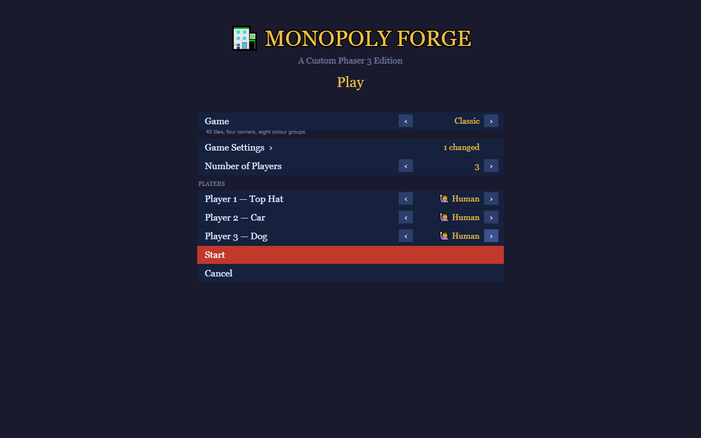 |
| **Main menu** — Play, Load and Settings, as a tree | **Play** — the game, its rules, the table |
|  |  |
| **Buy prompt** — price, base rent, your cash | **Cards** — Chance and Community Chest |
|  |  |
| **Jail** — entered by card, HUD shows the state | **Later** — owner bands on the tiles, cash diverging |
| 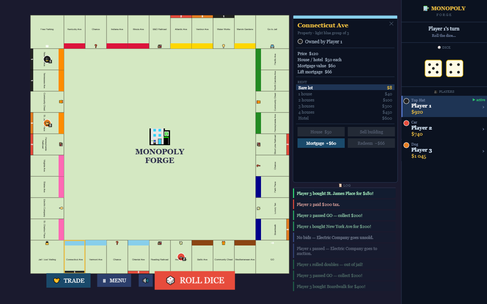 | 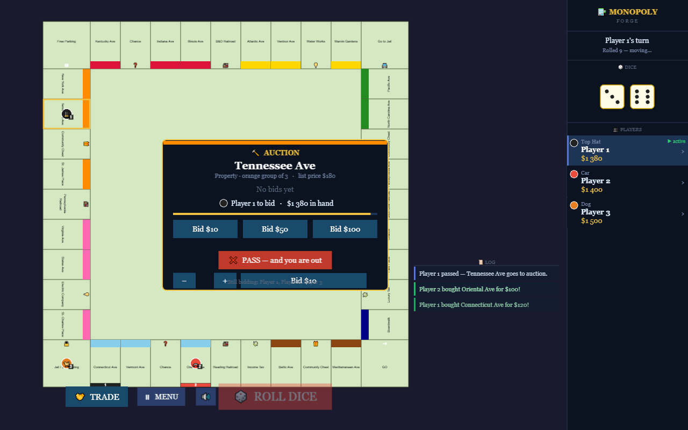 |
| **Property panel** — rent ladder, costs, build and mortgage actions | **Auction** — a declined property, round-robin bidding on a clock |
| 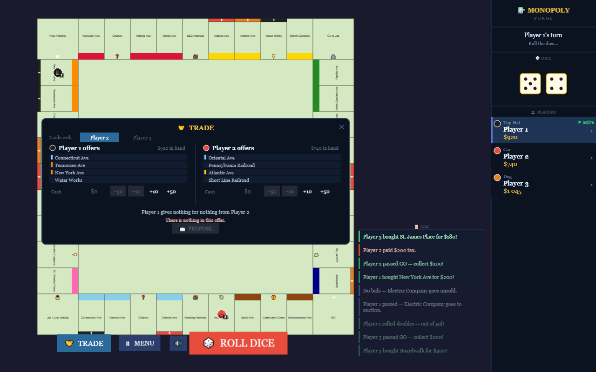 | 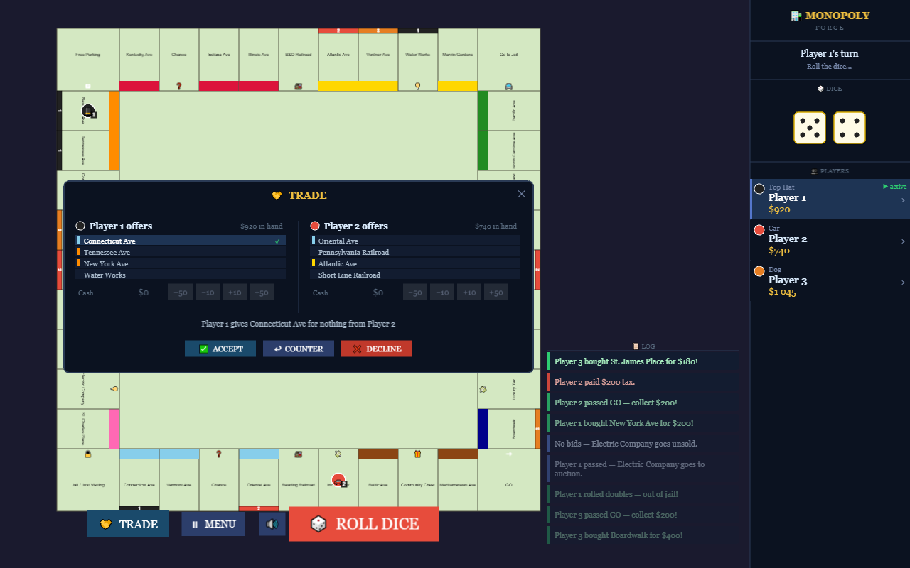 |
| **Trade** — build an offer from either side's deeds and cash | **…then accept, decline or counter it** |
| 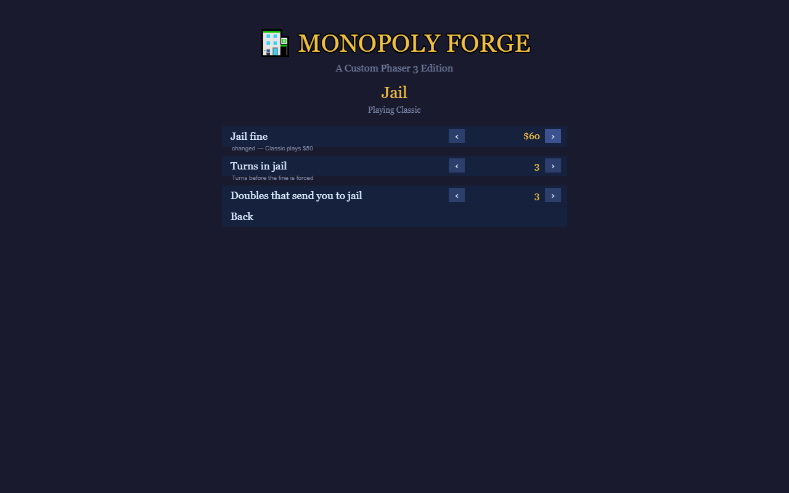 |  |
| **Game Settings** — generated from the rules themselves, saying what changed | **The board** — the classic 40 |
| 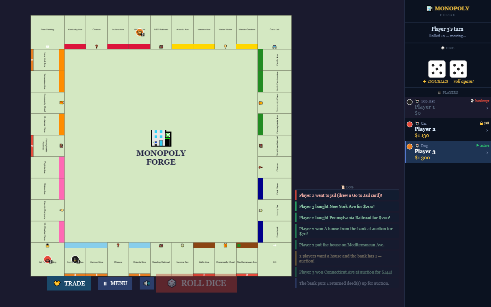 | 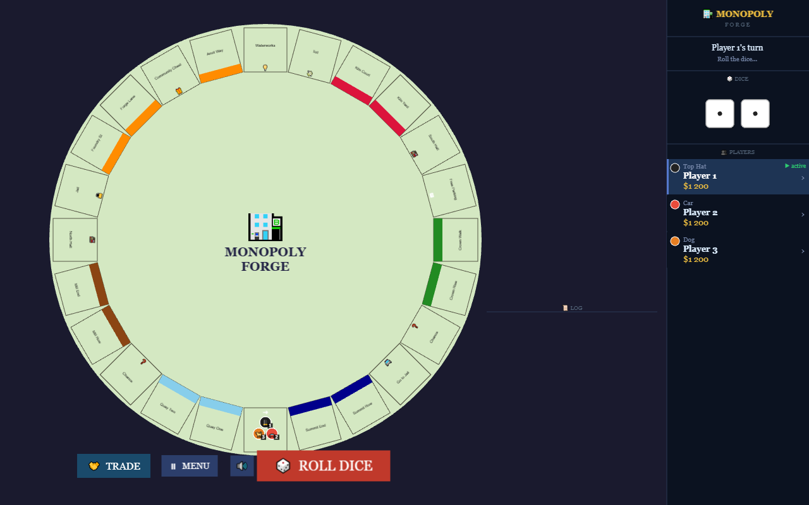 |
| **Bots** — every seat handed to the computer, playing itself | **Roundabout** — 24 tiles on a circle, no corners |
| 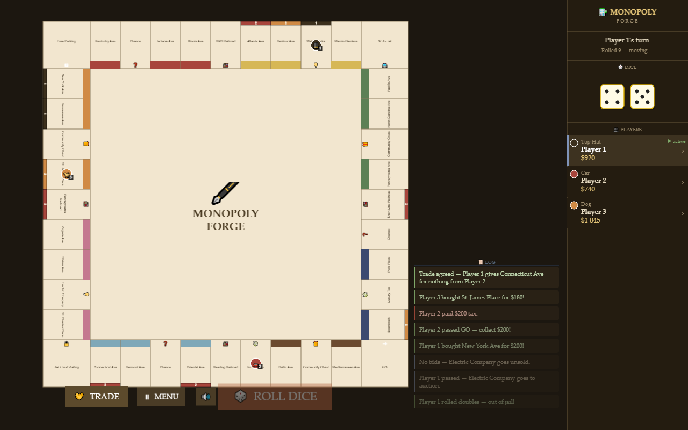 | 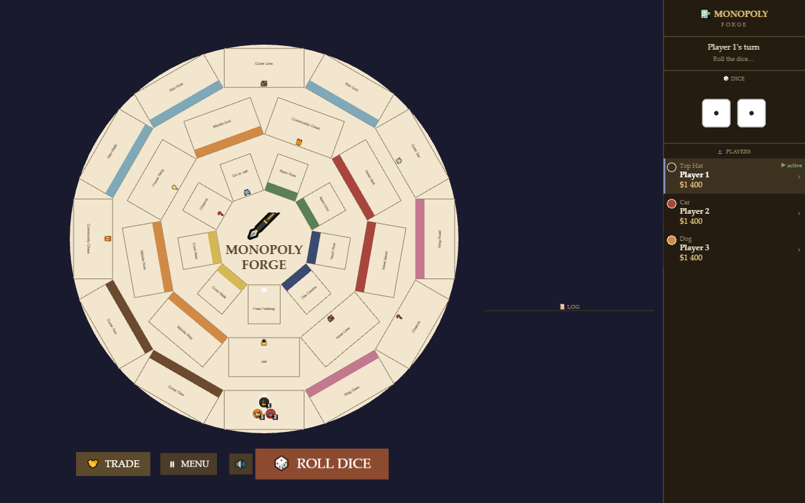 |
| **A palette changed mid-game** — board, pieces, chrome and HUD all repainted without restarting | **Orbits** — 30 tiles across three concentric rings, one loop |
| 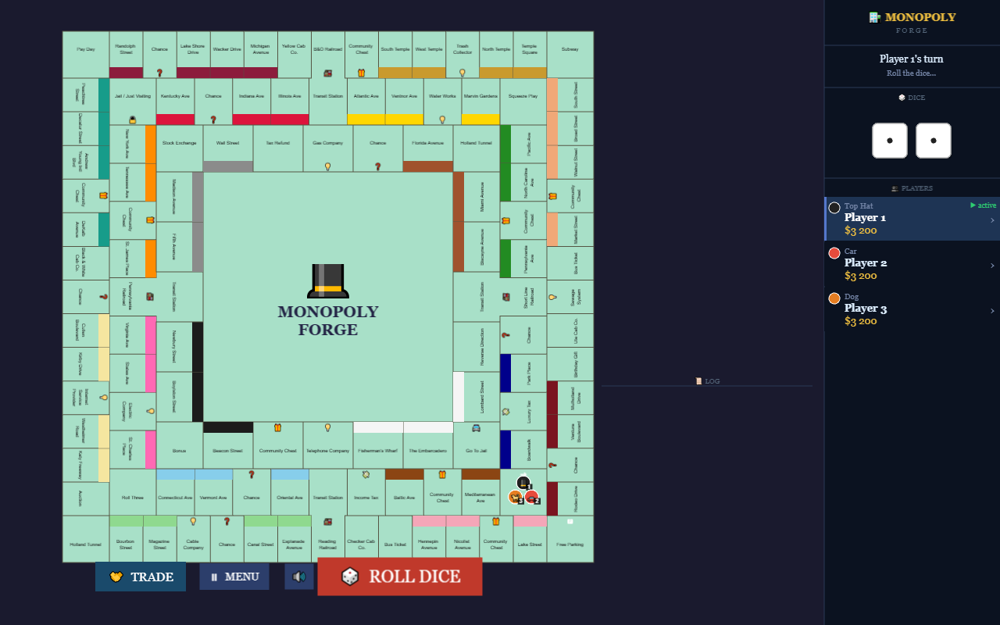 | |
| **Ultimate** — 120 tiles on three nested squares that are three *separate* loops | |

---

## How it is built

A **Phaser 3 + TypeScript** front end over a rules core that runs in plain Node —
no Phaser, no DOM, no canvas — which is what makes the model unit-testable and the
renderer replaceable. The two never call each other: state changes are announced
on a typed `EventBus` and scenes subscribe.

- **[docs/architecture.md](docs/architecture.md)** — the layers, the file layout,
  and what each module is responsible for.
- **[docs/engine.md](docs/engine.md)** — the three axes of customisation (maps,
  rules, presentation), what already supports them, and what had to change.
- **[docs/authoring-a-game.md](docs/authoring-a-game.md)** — adding a game of your
  own, as a worked example.
- **[CLAUDE.md](CLAUDE.md)** — the invariants a change has to respect, and the
  traps that have already cost time.

## Quick start

Requires **Node 22.12+** (see [.nvmrc](.nvmrc)); any bundled npm 10 or 11 works.

```bash
npm install
npm run dev        # dev server on http://localhost:3000 (debug logging on)
npm run build      # typecheck + production build → dist/
npm run preview    # serve the production build locally
```

`vite.config.ts` sets `base: './'`, so a build works unchanged from the dev
server, from `preview`, and from a GitHub Pages project sub-path.

### Reproducing a game

Append `?seed=<integer>` to the URL to re-seed the generator — the same seed gives
the same dice and the same card order every time. `?debug=1` turns the full turn
trace back on. They combine:

```
http://localhost:3000/?seed=20260512&debug=1
```

---

## Tests

```bash
npm test                # 527 unit tests, plain Node, ~8 s
npm run typecheck       # tsc --noEmit
npm run playtest        # build first: plays 30 seeded turns in a headless browser
npm run playtest -- --bots   # hand every seat to a bot and watch them play it out
npm run playtest -- --house-rules      # ...with the Free Parking jackpot on
npm run playtest -- --variants speedDie
npm run playtest -- --theme parchment    # ...and in the other palette
npm run simulate -- --games 500          # 500 headless games of every shipped game
npm run screenshots
npm run verify:install  # would CI's npm accept this lockfile?
```

**Unit tests** (`tests/`) cover the model, and lean deliberately towards the bugs
recorded in [DEVLOG.md](DEVLOG.md) — the positive-modulo fix that stops
`tiles[-1]`, dice never leaving 1–6, deck exhaustion and reshuffling, the jail
state machine, bank stock conservation, and the re-entry guard around ending a
turn.

**The playtest harness** (`tools/playtest.mjs`) serves the production build, opens
it in headless Chromium, clicks its way through a seeded game, and fails on any
console error, page exception, failed request or inconsistent end state. Both run
in CI, on Linux and Windows.

**`verify:install`** (`tools/verify-install.mjs`) answers a question a local
`npm ci` cannot: *would CI's npm accept this lockfile?* It fetches the npm bundled
with the Node version in `.nvmrc` — which is not necessarily the npm you develop
with — and checks lockfile agreement, tree consistency, and whether any declared
dependency has been installed at two different majors. Run it whenever
`package.json` or `package-lock.json` changes.

---

## Roadmap and known limitations

- [CHANGELOG.md](CHANGELOG.md) — what changed, newest first, one entry a milestone
- [ROADMAP.md](ROADMAP.md) — what is planned, and what is deliberately deferred,
  with the reasons
- [KNOWNISSUES.md](KNOWNISSUES.md) — measured defects, split into what is still
  **open** and what has been **closed** (kept for the record)
- [DEVLOG.md](DEVLOG.md) — the design decisions and the bug hunts behind them
- [CLAUDE.md](CLAUDE.md) — conventions and invariants for working in this codebase

The short version: the classic game is playable from the first roll to the last
player standing, and the engine the project is named for is built — M8 made the
board a file, the rules registries and presentation a theme; M9 made a game a
folder; M11 made a board something other than a circuit; and M12 closed the four
gaps that stopped Ultimate Monopoly'''s printed rules. What is left is on the
roadmap, and what is broken is measured rather than guessed at.

---

## Contributing

Issues and pull requests are welcome. Two conventions matter more than style:

1. **Cross-module communication goes through `EventBus`** — never import a scene
   from a model class.
2. **Keep the model free of Phaser.** Anything under `game/`, `tiles/`, `cards/`
   or `utils/` must stay runnable in Node, so it stays testable. `npm test` fails
   loudly if that breaks.

New tile types extend `Tile` and implement `onLand()`; new card effects extend the
`CardAction` union in `cards/CardDeck.ts`. A third convention is worth knowing
before touching the economy: `Bank` executes, it does not adjudicate — anything
that builds, sells or mortgages checks `game/BuildRules.ts` first. Run `npm test`
and `npm run playtest` before opening a PR.

---

## Licence and attribution

[MIT](LICENSE) © Dimitriuses.

No third-party assets: the board, tokens, dice and cards are all drawn
procedurally with Phaser's `Graphics` API, the sound effects are synthesised at
runtime with Web Audio, and the only runtime dependency is
[Phaser 3](https://phaser.io/) (MIT). The tile names are the classic Atlantic City
street names; this is an independent hobby implementation and is not affiliated
with or endorsed by Hasbro.
