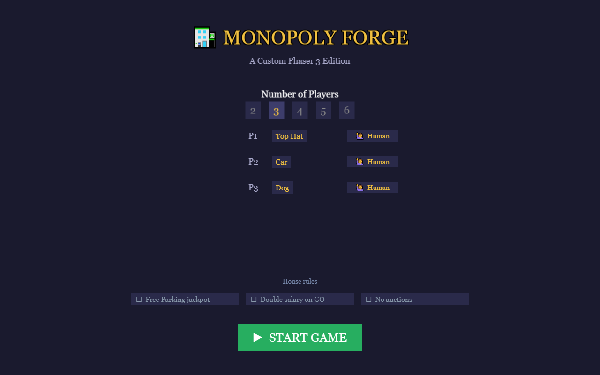
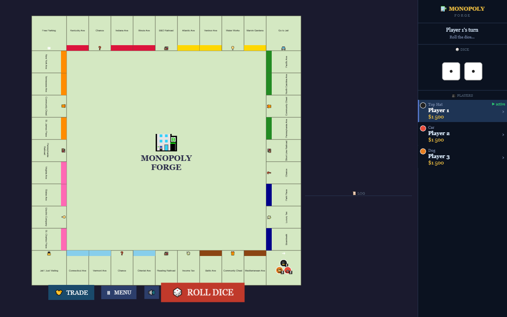
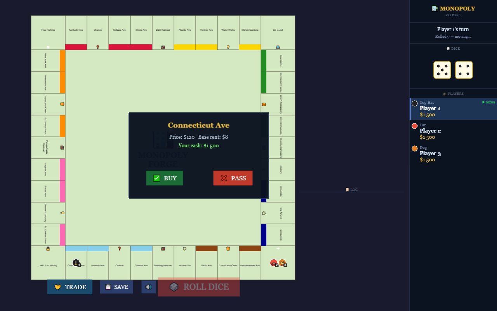
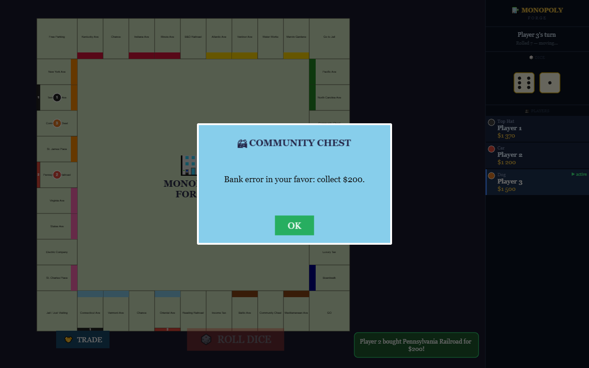
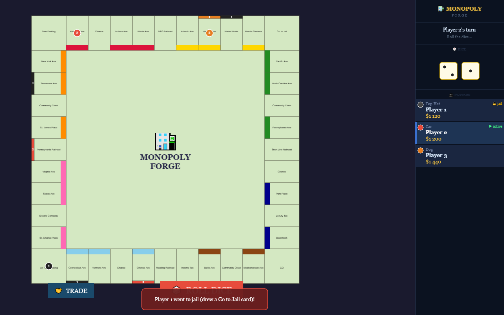
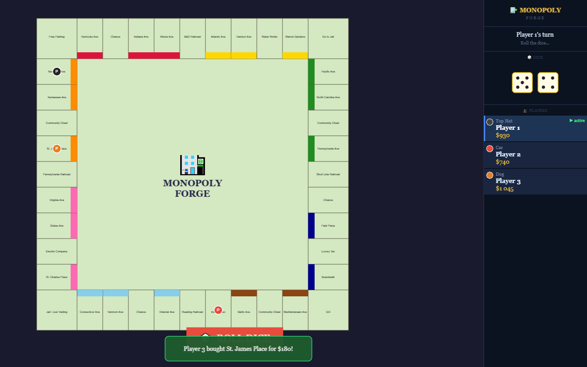

# 🏦 Monopoly Forge

A hot-seat Monopoly game for 2–6 players, built from scratch in **TypeScript** on
**Phaser 3** — with a rules engine that runs, and is tested, without a browser.

[](https://github.com/Dimitriuses/monopoly-forge/actions/workflows/ci.yml)
[](https://phaser.io/)
[](https://www.typescriptlang.org/)
[](https://vite.dev/)
[](LICENSE)
[](ROADMAP.md)

<!--
  ▶ LIVE DEMO — uncomment this line after the first green Pages deploy:
  (Settings → Pages → Source: GitHub Actions, then push. Load the URL once before
  publishing it — a dead demo link is worse than no link.)

**[▶ Play it in the browser](https://dimitriuses.github.io/monopoly-forge/)**
-->

---

## Controls

Everything is mouse-driven — there is no keyboard input.

| Action | How |
|---|---|
| Choose 2–6 players | Click a number on the menu |
| Change a player's token | Click the token name next to `P1`, `P2`, … to cycle |
| Start | **▶ START GAME** |
| Roll | **🎲 ROLL DICE**, below the board (greyed out when it is not your turn to roll) |
| Buy the property you landed on | **✅ BUY** in the prompt |
| Decline it | **❌ PASS** |
| Dismiss a Chance / Community Chest card | **OK** |
| Leave jail | **🔓 Pay $50** (or **🃏 Use Card** if you hold one) — appears below the board only when you are in jail and can afford it |

Hot-seat: all players share one screen, and the HUD on the right shows whose turn
it is.

---

## What it is

A complete implementation of the Monopoly turn loop: dice with doubles and the
three-doubles jail rule, step-by-step token movement, property/railroad/utility
purchase, the full rent ladder, both card decks with all 33 cards, taxes, the GO
salary, and every route in and out of jail.

The point of the project is the **engine underneath it**. The rules live in plain
TypeScript classes that import no Phaser and touch no DOM, communicate with the
renderer only through a typed event bus, and draw every random number from a
seeded PRNG — so a whole game is reproducible from a single integer, and the model
is unit-tested in bare Node with no jsdom and no canvas shim.

### Implemented

- **Turn engine** — phase FSM (`WAITING_FOR_ROLL → ROLLING → MOVING → LANDING → END_TURN`), doubles grant another roll, three in a row send you to jail
- **Board** — all 40 tiles with correct groups, prices, rent tiers and mortgage values, drawn procedurally
- **Movement** — tile-by-tile animated walk, GO salary paid on passing (and on landing exactly)
- **Property** — buy prompt for streets, railroads and utilities; rent from the tier table; railroad rent by how many the owner holds; utility rent at 4× or 10× the dice
- **Cards** — 16 Chance and 17 Community Chest, with advance / go-back / jail / collect / pay / pay-per-house effects, drawn from a shuffled deck with a discard pile that reshuffles
- **Jail** — enter by tile, card or three doubles; leave by doubles, a $50 fine, a Get Out of Jail Free card, or the forced fine after three turns
- **HUD** — animated dice, per-player cash, active-player highlight, jail markers, stacking toast notifications
- **Determinism** — `?seed=12345` replays an identical game

### Not implemented yet

Named honestly, because the board looks more finished than it is:

- **Houses, hotels and mortgages have no UI.** The bank logic is written and
  unit-tested — including returning four houses to the bank when a hotel goes up,
  and the 110% unmortgage fee — but nothing in the game calls it, so rent never
  rises above the bare-lot tier in play.
- **Ownership is invisible on the board.** Buying works and rent is charged, but
  no marker is drawn on the tile.
- **No auctions and no trading.** Declining a property just ends the turn.
- **Bankruptcy does not settle the estate** — a broke player is skipped, but their
  properties are not transferred.
- **Save/load is not wired up**, though the serialiser exists.

Full detail, with reproductions, in [KNOWNISSUES.md](KNOWNISSUES.md); what happens
next is in [ROADMAP.md](ROADMAP.md).

---

## Screenshots

Captured automatically by `npm run screenshots`, which drives the real game in a
headless browser — see [tools/playtest.mjs](tools/playtest.mjs).

| | |
|---|---|
|  |  |
| **Setup** — 2–6 players, cycle tokens | **Board** — 40 tiles, colour groups, HUD |
|  |  |
| **Buy prompt** — price, base rent, your cash | **Cards** — Chance and Community Chest |
|  |  |
| **Jail** — entered by card, HUD shows the state | **Later** — cash diverging through rent and tax |

---

## Architecture

The rule the codebase is built around: **a model class never imports a scene.**
State changes are announced on a typed event bus and the scenes react to them.

```
      ┌──────────────── model (no Phaser, no DOM) ────────────────┐
      │  Board · Player · Dice · Bank · TurnManager · CardDeck    │
      │  Tile ▸ PropertyTile · SpecialTiles   PRNG · SaveLoad     │
      └──────────────────────────┬───────────────────────────────┘
                                 │  bus.emit('rent:pay', …)
                          ┌──────▼──────┐
                          │  EventBus   │   typed pub/sub singleton
                          └──────┬──────┘
                                 │  bus.on('rent:pay', …)
      ┌──────────────────────────▼───────────────────────────────┐
      │  scenes: Boot · Menu · Game · UI · Card                  │
      │  ui: DiceView · PlayerPanel · Notification               │
      └──────────────────────────────────────────────────────────┘
```

Three consequences worth the trouble:

**The model runs in Node.** `src/config.ts` deliberately contains no Phaser
import — the `Phaser.Game` options live in `main.ts` instead — so everything under
`game/`, `tiles/`, `cards/` and `utils/` is reachable from a plain Node process.
That is what lets 100 unit tests run in ~8 s with no jsdom, and it is the seam a
headless AI opponent would plug into.

**Games are reproducible.** Every dice roll and both deck shuffles draw from one
seeded Mulberry32 generator (`src/utils/PRNG.ts`). `?seed=20260512` replays a game
exactly — the screenshot run above produces byte-identical final state on every
invocation, which is what makes the playtest harness a usable regression check.

**The debug trace is still in the code, and switchable.** The turn/card/jail
logging that found most of the bugs in [DEVLOG.md](DEVLOG.md) routes through
`src/utils/log.ts`: silent by default, on automatically under `npm run dev`, and
available on any build — including the deployed demo — with `?debug=1`.

### Layout

```
src/
├── main.ts               Phaser bootstrap, debug-logging switch
├── config.ts             40 tile definitions, geometry, economy constants  [no Phaser]
├── game/
│   ├── Board.ts          Tile registry, layout maths, validated getTile/move
│   ├── Player.ts         Position, cash, holdings, jail state
│   ├── Dice.ts           Rolls via the seeded PRNG
│   ├── Bank.ts           Transfers, purchase, mortgage, house/hotel stock
│   └── TurnManager.ts    Phase FSM, doubles, jail, turn order
├── tiles/                Tile base class ▸ PropertyTile, SpecialTiles
├── cards/CardDeck.ts     Deck, discard/reshuffle, CardEffects, both decks
├── scenes/               Boot, Menu, Game (board + wiring), UI (HUD), Card
├── ui/                   DiceView, PlayerPanel, Notification
└── utils/                EventBus, PRNG, SaveLoad, log
tests/                    Vitest — model only, plain Node
tools/playtest.mjs        Plays the built game in a real browser
```

---

## Quick start

Requires **Node 22.12+** (see [.nvmrc](.nvmrc)); any bundled npm 10 or 11 works.

```bash
npm install
npm run dev        # dev server on http://localhost:3000 (debug logging on)
npm run build      # typecheck + production build → dist/
npm run preview    # serve the production build locally
```

`vite.config.ts` sets `base: './'`, so a build works unchanged from the dev
server, from `preview`, and from a GitHub Pages project sub-path.

### Reproducing a game

Append `?seed=<integer>` to the URL to re-seed the generator — the same seed gives
the same dice and the same card order every time. `?debug=1` turns the full turn
trace back on. They combine:

```
http://localhost:3000/?seed=20260512&debug=1
```

---

## Tests

```bash
npm test                # 100 unit tests, plain Node, ~7 s
npm run typecheck       # tsc --noEmit
npm run playtest        # build first: plays 30 seeded turns in a headless browser
npm run screenshots
npm run verify:install  # would CI's npm accept this lockfile?
```

**Unit tests** (`tests/`) cover the model, and lean deliberately towards the bugs
recorded in [DEVLOG.md](DEVLOG.md) — the positive-modulo fix that stops
`tiles[-1]`, dice never leaving 1–6, deck exhaustion and reshuffling, the jail
state machine, bank stock conservation, and the re-entry guard around ending a
turn.

**The playtest harness** (`tools/playtest.mjs`) serves the production build, opens
it in headless Chromium, clicks its way through a seeded game, and fails on any
console error, page exception, failed request or inconsistent end state. Both run
in CI, on Linux and Windows.

**`verify:install`** (`tools/verify-install.mjs`) answers a question a local
`npm ci` cannot: *would CI's npm accept this lockfile?* It fetches the npm bundled
with the Node version in `.nvmrc` — which is not necessarily the npm you develop
with — and checks lockfile agreement, tree consistency, and whether any declared
dependency has been installed at two different majors. Run it whenever
`package.json` or `package-lock.json` changes.

---

## Roadmap and known limitations

- [ROADMAP.md](ROADMAP.md) — what is planned, and what is deliberately deferred
  (with the reasons — save/load in particular is blocked on more than a button)
- [KNOWNISSUES.md](KNOWNISSUES.md) — measured defects in the current build
- [DEVLOG.md](DEVLOG.md) — the design decisions and the bug hunts behind them
- [CLAUDE.md](CLAUDE.md) — conventions and invariants for working in this codebase

The short version: the rules engine is solid and tested, the presentation layer
stops at "you can play a full turn loop". The next milestone is making ownership
visible and letting players build.

---

## Contributing

Issues and pull requests are welcome. Two conventions matter more than style:

1. **Cross-module communication goes through `EventBus`** — never import a scene
   from a model class.
2. **Keep the model free of Phaser.** Anything under `game/`, `tiles/`, `cards/`
   or `utils/` must stay runnable in Node, so it stays testable. `npm test` fails
   loudly if that breaks.

New tile types extend `Tile` and implement `onLand()`; new card effects extend the
`CardAction` union in `cards/CardDeck.ts`. Run `npm test` and `npm run playtest`
before opening a PR.

---

## Licence and attribution

[MIT](LICENSE) © Dimitriuses.

No third-party assets: the board, tokens, dice and cards are all drawn
procedurally with Phaser's `Graphics` API, and the only runtime dependency is
[Phaser 3](https://phaser.io/) (MIT). The tile names are the classic Atlantic City
street names; this is an independent hobby implementation and is not affiliated
with or endorsed by Hasbro.
